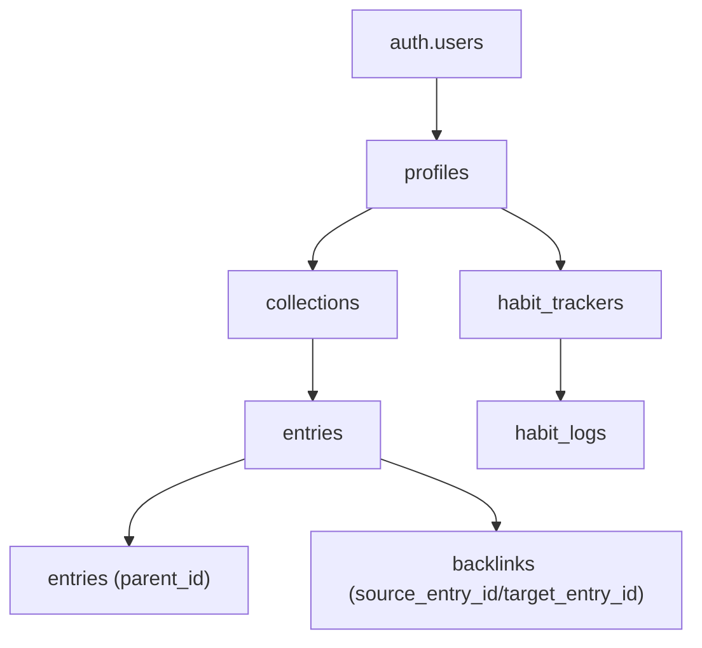

# Database Schema - Supabase

Este documento descreve a estrutura do banco de dados do e-Bujo no Supabase.

## Visão Geral

O schema foi projetado para suportar a filosofia Analog-First, mantendo a simplicidade estrutural enquanto permite funcionalidades digitais avançadas.  
A Migração 01 foca em perfis de usuário, coleções e entradas (`entries`), preparando o terreno para extensões futuras (hábitos, backlinks, etc.).

## Tabelas Principais (Migração 01)

### `auth.users` (Supabase)
Tabela gerenciada pelo Supabase Auth. Serve como origem da identidade do usuário.

Campos principais (simplificado):
- `id UUID` (PK)
- `email`
- metadados de autenticação

### `profiles`
Extende `auth.users` com preferências de UI e dados de perfil.

```sql
CREATE TABLE public.profiles (
  id UUID PRIMARY KEY REFERENCES auth.users(id) ON DELETE CASCADE,
  full_name TEXT,
  avatar_url TEXT,
  theme_preference TEXT DEFAULT 'ivory',
  updated_at TIMESTAMPTZ DEFAULT NOW()
);
```

### `collections`
Representa cadernos/agrupamentos do usuário (ex.: Trabalho, Pessoal, Projeto X).

```sql
CREATE TABLE public.collections (
  id UUID PRIMARY KEY DEFAULT uuid_generate_v4(),
  user_id UUID REFERENCES public.profiles(id) ON DELETE CASCADE,
  title TEXT NOT NULL,
  type TEXT CHECK (type IN ('journal', 'project', 'zettelkasten')),
  is_pinned BOOLEAN DEFAULT FALSE,
  created_at TIMESTAMPTZ DEFAULT NOW()
);

CREATE INDEX idx_collections_user ON public.collections(user_id);
```

- **Tipos de coleção**:
  - `journal`: caderno principal de journaling (Daily/Monthly/Future logs).
  - `project`: coleções focadas em projetos.
  - `zettelkasten`: notas atômicas para conhecimento conectável.

### Enums `entry_type` e `entry_status`

```sql
CREATE TYPE entry_type AS ENUM ('task', 'event', 'note', 'idea');
CREATE TYPE entry_status AS ENUM ('todo', 'completed', 'migrated', 'cancelled');
```

### `entries`
Unidade mínima de Rapid Logging. Cada linha é um ponto no BuJo (task/event/note/idea).

```sql
CREATE TABLE public.entries (
  id UUID PRIMARY KEY DEFAULT uuid_generate_v4(),
  user_id UUID REFERENCES auth.users(id) ON DELETE CASCADE,
  collection_id UUID REFERENCES public.collections(id) ON DELETE SET NULL,
  parent_id UUID REFERENCES public.entries(id) ON DELETE SET NULL,
  type entry_type DEFAULT 'note',
  status entry_status DEFAULT 'todo',
  content JSONB NOT NULL,
  raw_text TEXT,
  scheduled_date DATE DEFAULT CURRENT_DATE,
  created_at TIMESTAMPTZ DEFAULT NOW()
);

CREATE INDEX idx_entries_user_date ON public.entries (user_id, scheduled_date);
```

- **`type`**: classifica o símbolo BuJo (task, event, note, idea).
- **`status`**: acompanha o ciclo de vida da task (todo, completed, migrated, cancelled).
- **`content`**: documento TipTap em formato JSON (rich text).
- **`raw_text`**: texto plano para busca full-text.
- **`scheduled_date`**: ancora a entrada no Daily/Monthly/Future Log.
- **`parent_id`**: permite subtarefas/threading entre entries.

## Extensões: Hábitos e Backlinks (Migração 02)

### `habit_trackers`
Configura metas de hábitos por usuário (ex.: "Beber água", "Ler").

```sql
CREATE TABLE public.habit_trackers (
  id UUID PRIMARY KEY DEFAULT uuid_generate_v4(),
  user_id UUID REFERENCES public.profiles(id) ON DELETE CASCADE,
  name TEXT NOT NULL,
  goal_value INTEGER,
  unit TEXT,
  frequency JSONB,
  created_at TIMESTAMPTZ DEFAULT NOW()
);
```

### `habit_logs`
Registra ocorrências diárias (ou por sessão) dos hábitos.

```sql
CREATE TABLE public.habit_logs (
  id UUID PRIMARY KEY DEFAULT uuid_generate_v4(),
  habit_id UUID REFERENCES public.habit_trackers(id) ON DELETE CASCADE,
  completed_at DATE NOT NULL,
  value INTEGER,
  created_at TIMESTAMPTZ DEFAULT NOW()
);
```

### `backlinks`
Mantém o grafo de conhecimento entre `entries`, permitindo navegação estilo Obsidian.

```sql
CREATE TABLE public.backlinks (
  id UUID PRIMARY KEY DEFAULT uuid_generate_v4(),
  source_entry_id UUID REFERENCES public.entries(id) ON DELETE CASCADE,
  target_entry_id UUID REFERENCES public.entries(id) ON DELETE CASCADE,
  context_snippet TEXT,
  created_at TIMESTAMPTZ DEFAULT NOW()
);
```

## Relacionamentos (Migração 01 + 02)



## Políticas RLS (Row Level Security)

As políticas são aplicadas diretamente nas tabelas para garantir que cada usuário só enxergue seus próprios dados:

- **`profiles`**: `SELECT`/`UPDATE` restritos a `id = auth.uid()`.
- **`collections`**: `SELECT`/`INSERT`/`UPDATE`/`DELETE` restritos a linhas com `user_id = auth.uid()`.
- **`entries`**: todas as operações filtradas por `user_id = auth.uid()`.
- **`habit_trackers`**: totalmente restritos a `user_id = auth.uid()`.
- **`habit_logs`**: acesso apenas se o `habit_id` pertencer a um `habit_tracker` cujo `user_id = auth.uid()`.
- **`backlinks`**: acesso permitido apenas quando tanto `source_entry_id` quanto `target_entry_id` pertencem a entries do usuário autenticado.

## Notas de Implementação

- Todas as tabelas principais têm `created_at` e/ou `updated_at` para rastreio temporal.
- `uuid_generate_v4()` é usado para chaves primárias onde apropriado.
- Índices atuais:
  - `idx_collections_user` em `collections(user_id)`.
  - `idx_entries_user_date` em `entries(user_id, scheduled_date)` para consultas de Daily/Monthly Log.
  - Índices auxiliares em `habit_trackers(user_id)`, `habit_logs(habit_id, completed_at)`, `backlinks(source_entry_id)` e `backlinks(target_entry_id)`.
- Futuras otimizações:
  - Índices GIN em `content`/`raw_text` para busca full-text.

---

**Status**: Migrações 01 e 02 aplicadas ao schema (core de journaling, hábitos, backlinks e RLS) e prontas para uso via Supabase CLI e consumo por um frontend inicial.

---
